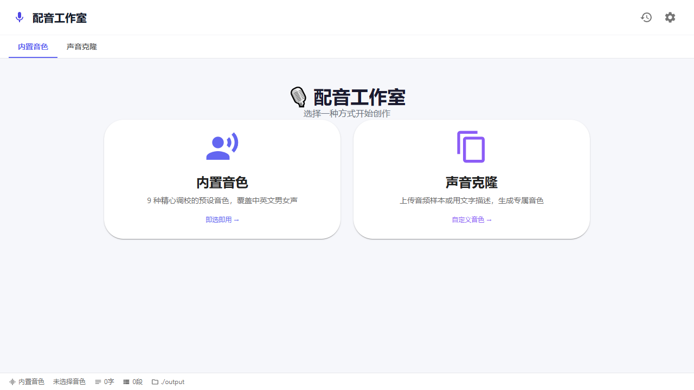
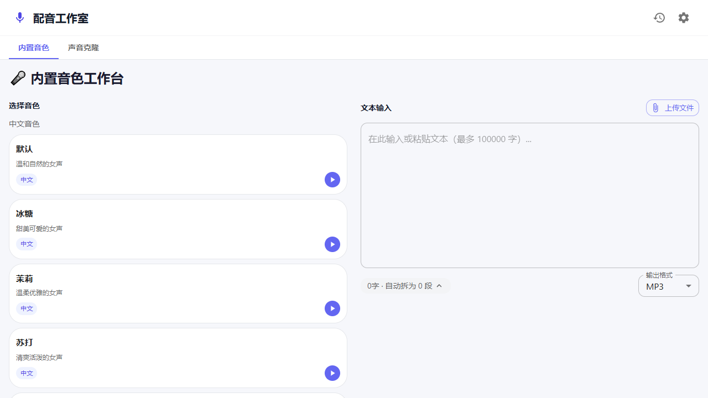
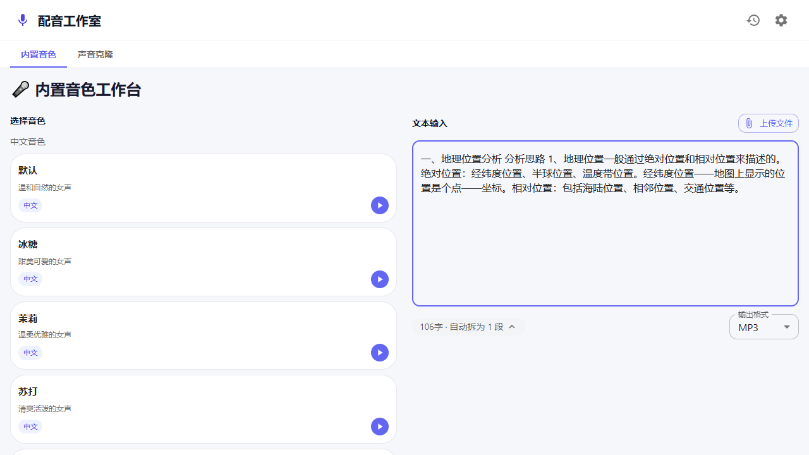

# TTS Studio &middot; 配音工作室

[English](#english) | [中文](#中文)

> A desktop TTS tool for the Xiaomi MiMo API — research preview.

---

<h2 id="english">English</h2>

## Overview

TTS Studio is a desktop application that provides a streamlined interface for Xiaomi's MiMo text-to-speech API. It handles long-form text input through automatic segmentation, concurrent generation, and local file output.



## Latest Release

**v4.3.0** fixes packaged Electron output: the Windows exe now exposes `window.electronAPI` correctly, restores automatic local saving, and re-enables opening generated output folders. See [CHANGELOG.md](CHANGELOG.md) or the [v4.3.0 release](https://github.com/misaka10074poi/tts-studio/releases/tag/v4.3.0) for details.

## Development Approach

This project was developed with **AI-assisted engineering**. The full stack — architecture design, UI layout, store management, service layer, Electron packaging, and iterative bug fixing — was built through structured collaboration between human direction and AI agents using the [Matt Pocock skills](https://github.com/mattpocock/skills) methodology (diagnose → triage → tdd → release). The development journal at `docs/dev-handoff.md` records the complete process.

## Disclaimer

> This project is in a **research and exploratory phase**. It is built on a third-party API (Xiaomi MiMo) and is not affiliated with Xiaomi. APIs, features, and interfaces may change without notice.

## Core Capabilities

| Capability | Detail |
|-----------|--------|
| Voice library | 9 Xiaomi MiMo built-in voices covering Mandarin and English (male & female) |



| Capability | Detail |
|-----------|--------|
| Voice customization | Clone from audio samples or describe via text prompts |
| Automatic segmentation | 500ms debounced real-time splitting; three-pass algorithm (paragraph detection → greedy merge → punctuation split) |


| Concurrent generation | 2 workers with AbortController-based cancellation and exponential-backoff retry (3 attempts) |
| Local file output | Structured output directory (`output/YYYY-MM-DD_taskname/`) with per-segment WAV, merged full-output WAV, and metadata JSON |
| Desktop packaging | Electron 33, `contextIsolation` enabled, filesystem access through main-process IPC |

## Getting Started

```bash
npm install
npm run dev              # Vite dev server (localhost:5173)
npm run build            # Production build → dist/
npm run electron:build   # Package standalone Windows executable
```

The packaged executable is at `release/配音工作室.exe`.

## Architecture

```
┌──────────┐     ┌──────────┐     ┌───────────┐
│  React   │ ──→ │ Zustand  │ ──→ │ Services  │ ──→ MiMo API
│  Views   │ ←── │ Stores   │ ←── │           │ ──→ Local FS
└──────────┘     └──────────┘     └───────────┘
                       ↕
              Electron Preload Bridge
         (openPath / writeFile / ensureDir)
```

For domain terminology and design decisions, see `CONTEXT.md`. For the full development history, see `docs/dev-handoff.md` and `CHANGELOG.md`.

## Configuration

This repository contains **no API credentials**. Configure your MiMo endpoint and key through the Settings dialog within the application. Values persist in browser `localStorage` and are never committed to version control.

## Tech Stack

React 18 &middot; TypeScript 5 &middot; Vite 5 &middot; MUI 5 &middot; Tailwind CSS 3 &middot; Zustand 4 &middot; Electron 33 &middot; Node 20

## License

MIT

---

<h2 id="中文">中文</h2>

## 项目概述

TTS Studio 是一个桌面端应用，为小米 MiMo 文本转语音 API 提供便捷的操作界面。支持长文本自动分段、并发生成、本地文件输出。


## 最新版本

**v4.3.0** 修复了 Electron 打包版输出问题：Windows exe 现在可以正确暴露 `window.electronAPI`，恢复自动保存到本地，并重新启用“打开输出目录”。详情见 [CHANGELOG.md](CHANGELOG.md) 或 [v4.3.0 Release](https://github.com/misaka10074poi/tts-studio/releases/tag/v4.3.0)。

## 开发方式

本项目采用 **AI 辅助工程** 方式开发。从架构设计、UI 布局、状态管理、服务层、Electron 打包到迭代排错，全部由人类主导方向、AI 代理执行实现，遵循 [Matt Pocock 技能体系](https://github.com/mattpocock/skills)（诊断 → 分类 → 测试驱动 → 发布）。完整开发日志见 `docs/dev-handoff.md`。

## 声明

> 本项目处于**研究探索阶段**，基于第三方 API（小米 MiMo）构建，与小米公司无关联。API、功能和界面可能随时调整。

## 核心能力

| 能力 | 说明 |
|------|------|
| 内置音色 | 9 种小米 MiMo 自带音色，覆盖中英文男女声 |


| 能力 | 说明 |
|------|------|
| 声音定制 | 上传音频样本克隆音色，或通过文字描述生成 |
| 自动分段 | 输入即拆，500ms 防抖，三段式算法（段落识别 → 贪婪合并 → 标点分拆） |


| 并发生成 | 2 路并发，AbortController 中止控制，指数退避重试（最多 3 次） |
| 本地输出 | 结构化输出目录 `output/YYYY-MM-DD_任务名/`，含分段 WAV、合并完整音频、元数据 JSON |
| 桌面打包 | Electron 33，`contextIsolation` 安全隔离，文件系统访问通过主进程 IPC |

## 快速开始

```bash
npm install
npm run dev              # Vite 开发服务器 (localhost:5173)
npm run build            # 生产构建 → dist/
npm run electron:build   # 打包 Windows 独立可执行文件
```

打包产物位于 `release/配音工作室.exe`，双击运行。

## 架构

```
┌──────────┐     ┌──────────┐     ┌───────────┐
│  React   │ ──→ │ Zustand  │ ──→ │ Services  │ ──→ MiMo API
│  视图层   │ ←── │  状态层  │ ←── │  服务层    │ ──→ 本地文件系统
└──────────┘     └──────────┘     └───────────┘
                       ↕
              Electron Preload 桥接层
         (openPath / writeFile / ensureDir)
```

领域术语和设计决策见 `CONTEXT.md`。完整开发历史见 `docs/dev-handoff.md` 和 `CHANGELOG.md`。

## 配置说明

本仓库**不含任何 API 密钥**。通过应用内的设置弹窗（齿轮图标）自行配置 MiMo 端点和 Key。配置数据存储在浏览器 `localStorage`，**绝不提交至版本控制**。

## 技术栈

React 18 &middot; TypeScript 5 &middot; Vite 5 &middot; MUI 5 &middot; Tailwind CSS 3 &middot; Zustand 4 &middot; Electron 33 &middot; Node 20

## 许可证

MIT
