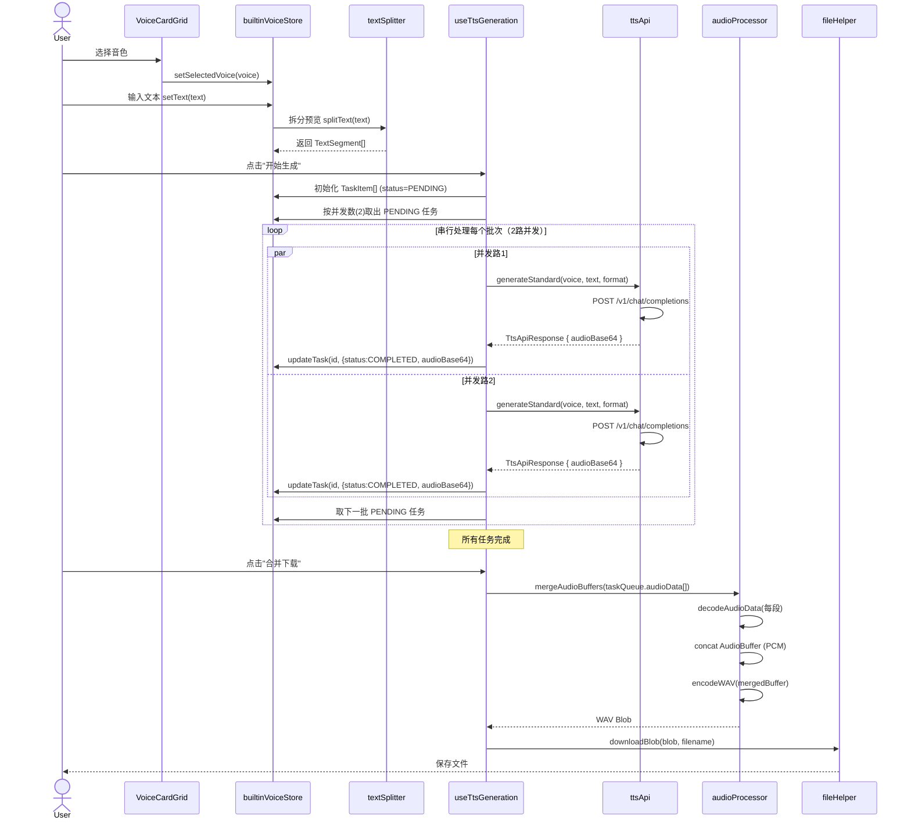
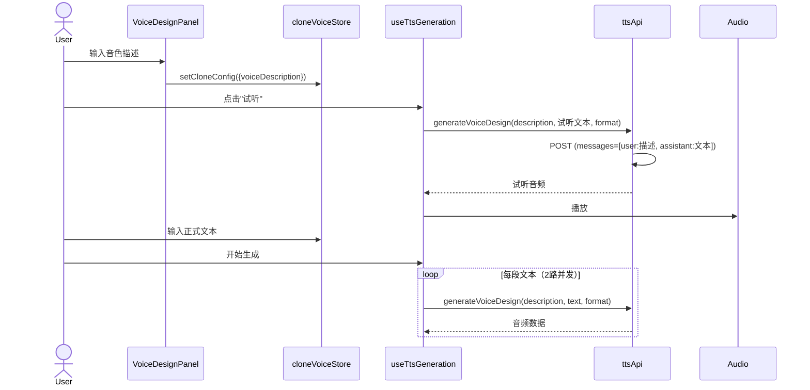
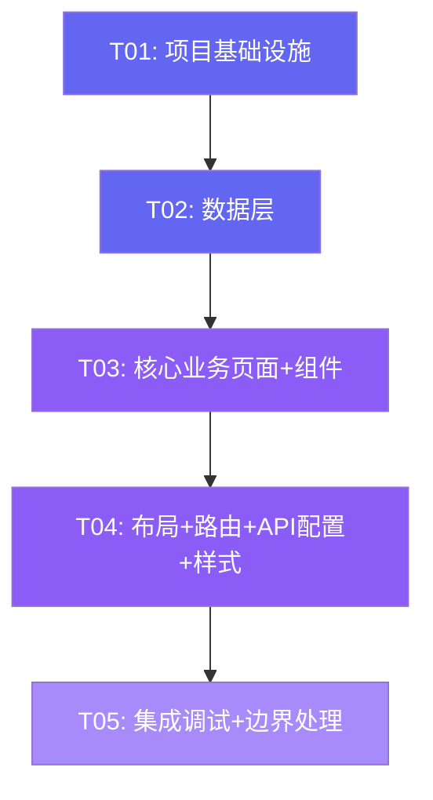

# 配音工作室（tts_studio）系统设计文档

---

## Part A: 系统设计

### 1. 实现方案

#### 1.1 核心技术挑战

| 挑战 | 说明 | 解决方案 |
|------|------|----------|
| 长文本拆分与重组 | 500字上限约束，需智能拆分 + 拼接还原完整音频 | 段落/句号/逗号三级拆分策略；Web Audio API 合并 AudioBuffer |
| API 并发控制 | 2路并发稳定，3路瓶颈 | 基于信号量的并发池，最大并发数可配置 |
| 纯前端 MP3 拼接 | MP3 不可直接 cat 拼接（Xing VBR 头冲突） | WAV 直接拼接（PCM 合并 → WAV 编码），MP3 输出走 Python 辅助脚本 |
| 大文件 Base64 编码 | 声音克隆需上传音频转 Base64 DataURL | FileReader 读取 + 10MB 限制 + 异步转码 |
| 任务队列状态管理 | 多段文本串行生成，每段独立状态 | 任务队列 Store，每段独立 state machine |
| API Key 安全 | 纯前端无法隐藏 Key | localStorage 持久化 + 界面可配置 + 仅供本地使用 |

#### 1.2 框架选型

| 类别 | 选型 | 理由 |
|------|------|------|
| 构建工具 | Vite 5 | 快速 HMR，原生 ESM，零配置开箱即用 |
| UI 框架 | React 18 | 组件化开发，生态成熟，团队熟悉 |
| 组件库 | MUI 5 | 企业级组件库，主题定制强，开箱即用的高级组件（Card、Stepper、Chip） |
| 样式方案 | Tailwind CSS 3 | 原子化 CSS，快速布局，与 MUI 互补（Tailwind 布局 + MUI 组件） |
| 状态管理 | Zustand | 轻量（<1KB），无 boilerplate，适合中型应用 |
| 路由 | React Router 6 | 声明式路由，支持嵌套布局 |
| HTTP 客户端 | 原生 fetch | API 简单，无需额外依赖，支持 AbortController 取消请求 |
| 音频处理 | Web Audio API + lamejs | 解码合并音频 + MP3 编码（可选） |
| 文件下载 | file-saver | 跨浏览器文件保存 |

#### 1.3 架构模式

采用 **MVVM 变体**（View - Store - Service）：

```
View (React Components)
  ↕ 读取/写入
Store (Zustand) ←── Service (API/Audio 工具)
  ↕ 调用
Service (业务逻辑无状态)
```

- **View**：纯 UI 展示 + 事件触发，不包含业务逻辑
- **Store**：Zustand 管理全局状态，包含状态派生逻辑
- **Service**：无状态的纯函数/工具类，负责 API 调用、音频处理、文本拆分

---

### 2. 文件列表

```
tts_studio/
├── index.html                          # 入口 HTML
├── package.json                        # 依赖声明
├── vite.config.ts                      # Vite 配置
├── tailwind.config.ts                  # Tailwind 配置
├── tsconfig.json                       # TypeScript 配置
├── postcss.config.js                   # PostCSS 配置（Tailwind 需要）
├── scripts/
│   └── merge_mp3.py                    # MP3 拼接辅助脚本（ffmpeg）
├── src/
│   ├── main.tsx                        # React 入口，挂载 App
│   ├── App.tsx                         # 根组件，路由 + 主题 + 布局
│   ├── vite-env.d.ts                   # Vite 类型声明
│   │
│   ├── types/
│   │   └── index.ts                    # 全局 TypeScript 类型定义
│   │
│   ├── config/
│   │   └── voices.ts                   # 内置音色配置（9种音色元数据）
│   │
│   ├── store/
│   │   ├── apiConfigStore.ts           # API 配置状态（端点/Key/模型）
│   │   ├── builtinVoiceStore.ts        # 内置音色工作台状态
│   │   ├── cloneVoiceStore.ts          # 声音克隆工作台状态
│   │   └── taskQueueStore.ts           # 任务队列状态（通用）
│   │
│   ├── services/
│   │   ├── ttsApi.ts                   # TTS API 调用（三模型统一封装）
│   │   ├── textSplitter.ts             # 文本智能拆分
│   │   ├── audioProcessor.ts           # 音频处理（解码/合并/编码）
│   │   └── fileHelper.ts              # 文件工具（下载/读取/转Base64）
│   │
│   ├── pages/
│   │   ├── HomePage.tsx                # 首页（模式选择）
│   │   ├── BuiltinVoicePage.tsx        # 内置音色工作台页面
│   │   └── CloneVoicePage.tsx          # 声音克隆工作台页面
│   │
│   ├── components/
│   │   ├── layout/
│   │   │   ├── AppLayout.tsx           # 全局布局（顶栏+内容区）
│   │   │   └── ApiConfigDialog.tsx     # API 配置弹窗
│   │   ├── builtin/
│   │   │   ├── VoiceCardGrid.tsx       # 音色卡片网格（9宫格）
│   │   │   ├── VoiceCard.tsx           # 单个音色卡片（试听按钮）
│   │   │   ├── TextInputPanel.tsx      # 文本输入+拆分预览面板
│   │   │   └── GenerationPanel.tsx     # 生成控制+输出面板
│   │   ├── clone/
│   │   │   ├── CloneMethodSelector.tsx # 克隆方式选择（上传/描述）
│   │   │   ├── AudioUploadPanel.tsx    # 音频上传面板
│   │   │   ├── VoiceDesignPanel.tsx    # 文字描述定制面板
│   │   │   └── CloneConfigPanel.tsx    # 克隆音色配置+试听
│   │   └── common/
│   │       ├── AudioPlayer.tsx         # 通用音频播放器
│   │       ├── TaskQueueList.tsx       # 任务队列列表（状态可视化）
│   │       ├── TaskQueueItem.tsx       # 单个任务项（进度/重试）
│   │       └── DownloadButton.tsx      # 下载按钮（格式选择）
│   │
│   ├── hooks/
│   │   ├── useTtsGeneration.ts         # TTS 生成 hook（并发控制）
│   │   └── useAudioPlayer.ts           # 音频播放 hook
│   │
│   └── utils/
│       └── constants.ts                # 常量定义（默认API地址/Key/并发数等）
```

---

### 3. 数据结构与接口

```mermaid
classDiagram
    direction LR

    class ApiConfig {
        +string endpoint
        +string apiKey
        +number maxConcurrency
        +saveToLocalStorage() void
        +loadFromLocalStorage() ApiConfig
    }

    class VoiceProfile {
        +string id
        +string name
        +string nameZh
        +string description
        +string category
        +string voiceParam
    }

    class TextSegment {
        +string id
        +number index
        +string text
        +number charCount
    }

    class TaskItem {
        +string id
        +string segmentId
        +TaskStatus status
        +string audioBase64
        +ArrayBuffer audioData
        +number duration
        +string errorMessage
        +number retryCount
    }

    class TaskQueue {
        +TaskStatus status
        +TaskItem[] items
        +AudioFormat outputFormat
        +mergeAndDownload() void
        +retryFailed() void
        +reset() void
    }

    class CloneConfig {
        +CloneMethod method
        +string audioBase64
        +string audioFileName
        +string voiceDescription
        +ArrayBuffer sampleAudioData
    }

    class TtsRequest {
        +TtsModel model
        +string text
        +AudioFormat format
        +string voice
    }

    class TtsResponse {
        +boolean success
        +string audioBase64
        +string error
    }

    class AudioFormat {
        <<enumeration>>
        MP3
        WAV
        PCM16
    }

    class TaskStatus {
        <<enumeration>>
        PENDING
        GENERATING
        COMPLETED
        FAILED
    }

    class CloneMethod {
        <<enumeration>>
        UPLOAD
        DESCRIBE
    }

    class TtsModel {
        <<enumeration>>
        STANDARD
        VOICE_CLONE
        VOICE_DESIGN
    }

    ApiConfig --> TtsRequest : configures
    VoiceProfile --> TtsRequest : provides voice param
    TextSegment --> TaskItem : 1:1 mapping
    TaskItem --> TaskQueue : belongs to
    CloneConfig --> TtsRequest : configures clone voice
    TtsRequest --> TtsResponse : API call returns
    TaskStatus --> TaskItem : status tracking
    AudioFormat --> TaskQueue : output format
    CloneMethod --> CloneConfig : method type
    TtsModel --> TtsRequest : model selection
```

#### 关键接口定义（TypeScript）

```typescript
// === 枚举 ===
enum AudioFormat { MP3 = 'mp3', WAV = 'wav', PCM16 = 'pcm16' }
enum TaskStatus { PENDING = 'pending', GENERATING = 'generating', COMPLETED = 'completed', FAILED = 'failed' }
enum CloneMethod { UPLOAD = 'upload', DESCRIBE = 'describe' }
enum TtsModel { STANDARD = 'mimo-v2.5-tts', VOICE_CLONE = 'mimo-v2.5-tts-voiceclone', VOICE_DESIGN = 'mimo-v2.5-tts-voicedesign' }

// === 数据模型 ===
interface VoiceProfile {
  id: string;              // 如 'mimo_default'
  name: string;            // 英文名
  nameZh: string;          // 中文名
  description: string;     // 描述
  category: 'chinese' | 'english';  // 分类
  voiceParam: string;      // API voice 参数值
}

interface TextSegment {
  id: string;              // uuid
  index: number;           // 顺序号
  text: string;            // 文本内容
  charCount: number;       // 字数
}

interface TaskItem {
  id: string;              // uuid
  segmentId: string;       // 对应 TextSegment.id
  status: TaskStatus;
  audioBase64?: string;    // API 返回的 Base64
  audioData?: ArrayBuffer; // 解码后的音频数据
  duration?: number;       // 音频时长（秒）
  errorMessage?: string;
  retryCount: number;      // 重试次数，最多3次
}

interface CloneConfig {
  method: CloneMethod;
  audioBase64?: string;        // 上传音频的 Base64 DataURL
  audioFileName?: string;
  voiceDescription?: string;   // 文字描述
  sampleAudioData?: ArrayBuffer;
}

// === API 接口 ===
interface TtsRequest {
  model: TtsModel;
  text: string;
  format: AudioFormat;
  voice?: string;           // 内置音色名 或 Base64 DataURL（克隆）
  voiceDescription?: string; // voicedesign 描述
}

interface TtsApiResponse {
  success: boolean;
  audioBase64?: string;
  error?: string;
}

// === Store 状态 ===
interface ApiConfigState {
  endpoint: string;
  apiKey: string;
  maxConcurrency: number;
  setEndpoint: (v: string) => void;
  setApiKey: (v: string) => void;
  setMaxConcurrency: (v: number) => void;
}

interface BuiltinVoiceState {
  selectedVoice: VoiceProfile | null;
  text: string;
  segments: TextSegment[];
  taskQueue: TaskItem[];
  outputFormat: AudioFormat;
  setSelectedVoice: (v: VoiceProfile) => void;
  setText: (t: string) => void;
  setSegments: (s: TextSegment[]) => void;
  addTask: (t: TaskItem) => void;
  updateTask: (id: string, partial: Partial<TaskItem>) => void;
  setOutputFormat: (f: AudioFormat) => void;
  reset: () => void;
}

interface CloneVoiceState {
  cloneConfig: CloneConfig;
  text: string;
  segments: TextSegment[];
  taskQueue: TaskItem[];
  outputFormat: AudioFormat;
  setCloneConfig: (c: Partial<CloneConfig>) => void;
  // ... 同 BuiltinVoice 类似方法
}
```

---

### 4. 程序调用流程

#### 4.1 内置音色 - 完整生成流程



#### 4.2 声音克隆 - 样本上传流程

```mermaid
sequenceDiagram
    actor User
    participant UP as AudioUploadPanel
    participant Store as cloneVoiceStore
    participant FH as fileHelper
    participant Hook as useTtsGeneration
    participant API as ttsApi
    participant Audio as audioProcessor

    User->>UP: 上传音频文件
    UP->>FH: readFileAsDataURL(file)
    FH->>FH: 验证格式(mp3/wav) + 大小(≤10MB) + 时长(5-30s)
    FH-->>UP: data:audio/mp3;base64,...
    UP->>Store: setCloneConfig({audioBase64, audioFileName})

    User->>Store: 输入文本
    User->>Hook: 点击"开始生成"

    loop 每段文本（2路并发）
        Hook->>API: generateClone(audioBase64, text, format)
        API->>API: POST (voice=data:audio/mp3;base64,...)
        API-->>Hook: TtsApiResponse { audioBase64 }
        Hook->>Store: updateTask(COMPLETED)
    end

    User->>Hook: 合并下载
    Hook->>Audio: mergeAudioBuffers → encodeWAV
    Audio-->>User: 下载完整音频
```

#### 4.3 声音克隆 - 文字设计音色流程



#### 4.4 API 调用详细流程

```mermaid
sequenceDiagram
    participant Hook as useTtsGeneration
    participant API as ttsApi
    participant Server as MiMo API Server

    Hook->>API: generate(request: TtsRequest)
    API->>API: 构建请求体
    Note over API: 标准TTS: {model, messages:[{role:assistant, content:text}], audio:{format, voice}}
    Note over API: 克隆: voice=data:audio/mp3;base64,...
    Note over API: 设计: messages=[{role:user, content:描述}, {role:assistant, content:text}]
    
    API->>Server: POST /v1/chat/completions
    Note over API: Headers: Authorization: Bearer <key>

    alt 成功
        Server-->>API: 200 {choices:[{message:{audio:base64}}]}
        API->>API: 提取 audioBase64
        API-->>Hook: {success: true, audioBase64}
    else 失败
        Server-->>API: 4xx/5xx 错误
        API-->>Hook: {success: false, error: message}
    end
```

---

### 5. 待明确事项

| # | 事项 | 当前假设 | 风险 |
|---|------|----------|------|
| 1 | MiMo API 返回的 Base64 具体结构 | 假设返回 `choices[0].message.audio` 字段包含 Base64 字符串 | 需实测确认返回格式 |
| 2 | PCM16 输出格式前端拼接 | 假设 PCM16 可直接二进制拼接，WAV 头单独构建 | PCM16 编码细节需确认 |
| 3 | 声音克隆样本时长验证 | 前端用 AudioContext.decodeAudioData 获取时长 | 大文件解码可能慢 |
| 4 | voicedesign 试听 token 消耗 | 试听短文本（约50字）调一次 API | 用户已接受不省 token |
| 5 | Web Audio API 浏览器兼容性 | 目标 Chrome/Edge 最新版，Safari 可能有差异 | 移动端兼容性未验证 |
| 6 | 超长文本（>10000字）性能 | 建议 10000 字上限，但未硬限制 | 前端内存可能不足（大量音频 Buffer） |

---

## Part B: 任务分解

### 6. 依赖包

```
- react@^18.2.0: UI 框架
- react-dom@^18.2.0: React DOM 渲染
- react-router-dom@^6.20.0: 客户端路由
- @mui/material@^5.14.0: Material UI 组件库
- @mui/icons-material@^5.14.0: MUI 图标
- @emotion/react@^11.11.0: MUI 样式引擎（必需依赖）
- @emotion/styled@^11.11.0: MUI 样式引擎（必需依赖）
- zustand@^4.4.0: 状态管理
- tailwindcss@^3.4.0: 原子化 CSS
- postcss@^8.4.0: CSS 处理（Tailwind 依赖）
- autoprefixer@^10.4.0: CSS 前缀（Tailwind 依赖）
- file-saver@^2.0.5: 文件下载
- uuid@^9.0.0: ID 生成
- typescript@^5.3.0: 类型系统
- @types/react@^18.2.0: React 类型
- @types/react-dom@^18.2.0: React DOM 类型
- @types/file-saver@^2.0.7: file-saver 类型
- @vitejs/plugin-react@^4.2.0: Vite React 插件
- vite@^5.0.0: 构建工具
```

---

### 7. 任务列表（按依赖顺序）

#### T01: 项目基础设施

**说明**：创建项目骨架，所有配置文件 + 入口文件 + 依赖声明一步到位。

**源文件**：
- `package.json` — 依赖声明 + scripts
- `vite.config.ts` — Vite 配置（React 插件、路径别名）
- `tsconfig.json` — TypeScript 配置
- `tailwind.config.ts` — Tailwind 配置（MUI prefix 避免冲突）
- `postcss.config.js` — PostCSS 配置
- `index.html` — HTML 入口
- `src/main.tsx` — React 挂载点
- `src/App.tsx` — 根组件（ThemeProvider + Router 占位）
- `src/vite-env.d.ts` — Vite 类型声明
- `scripts/merge_mp3.py` — MP3 拼接辅助脚本

**依赖**：无  
**优先级**：P0

---

#### T02: 数据层（类型 + 配置 + 状态管理 + 服务）

**说明**：所有 TypeScript 类型定义、音色配置数据、Zustand Store、核心 Service 逻辑。

**源文件**：
- `src/types/index.ts` — 全局类型（枚举、接口定义）
- `src/config/voices.ts` — 9种内置音色元数据
- `src/utils/constants.ts` — 常量（默认API地址/Key/并发数/拆分阈值）
- `src/store/apiConfigStore.ts` — API 配置 Store
- `src/store/builtinVoiceStore.ts` — 内置音色工作台 Store
- `src/store/cloneVoiceStore.ts` — 声音克隆工作台 Store
- `src/store/taskQueueStore.ts` — 任务队列通用 Store
- `src/services/ttsApi.ts` — TTS API 统一封装（三模型）
- `src/services/textSplitter.ts` — 文本智能拆分
- `src/services/audioProcessor.ts` — 音频解码/合并/WAV编码
- `src/services/fileHelper.ts` — 文件读取/下载/Base64转码
- `src/hooks/useTtsGeneration.ts` — TTS 生成 Hook（并发池）
- `src/hooks/useAudioPlayer.ts` — 音频播放 Hook

**依赖**：T01  
**优先级**：P0

---

#### T03: 核心业务页面 + 组件

**说明**：首页、内置音色工作台、声音克隆工作台三个页面及其核心业务组件。

**源文件**：
- `src/pages/HomePage.tsx` — 首页（模式选择卡片）
- `src/pages/BuiltinVoicePage.tsx` — 内置音色工作台
- `src/pages/CloneVoicePage.tsx` — 声音克隆工作台
- `src/components/builtin/VoiceCardGrid.tsx` — 音色卡片网格
- `src/components/builtin/VoiceCard.tsx` — 单个音色卡片
- `src/components/builtin/TextInputPanel.tsx` — 文本输入+拆分预览
- `src/components/builtin/GenerationPanel.tsx` — 生成控制+输出面板
- `src/components/clone/CloneMethodSelector.tsx` — 克隆方式选择
- `src/components/clone/AudioUploadPanel.tsx` — 音频上传面板
- `src/components/clone/VoiceDesignPanel.tsx` — 文字描述定制面板
- `src/components/clone/CloneConfigPanel.tsx` — 克隆音色配置+试听
- `src/components/common/TaskQueueList.tsx` — 任务队列列表
- `src/components/common/TaskQueueItem.tsx` — 单个任务项
- `src/components/common/AudioPlayer.tsx` — 音频播放器
- `src/components/common/DownloadButton.tsx` — 下载按钮

**依赖**：T02  
**优先级**：P0

---

#### T04: 布局 + 路由 + API配置 + 样式

**说明**：全局布局、路由配置、API配置弹窗、全局样式和主题定制。

**源文件**：
- `src/components/layout/AppLayout.tsx` — 全局布局（顶栏+侧边+内容区）
- `src/components/layout/ApiConfigDialog.tsx` — API 配置弹窗
- `src/App.tsx` — 更新：路由配置 + 主题 + 布局集成

**依赖**：T03  
**优先级**：P1

---

#### T05: 集成调试 + 边界处理 + 体验优化

**说明**：端到端集成测试、错误处理完善、加载状态优化、边界情况处理。

**源文件**：
- 所有已有文件（修复/优化）
- 重点调整：`useTtsGeneration.ts`（并发边界）、`audioProcessor.ts`（大文件内存）、`ttsApi.ts`（超时/重试）

**依赖**：T04  
**优先级**：P1

---

### 8. 共享知识

```
1. API 调用约定
   - 所有 API 请求通过 services/ttsApi.ts 统一发出
   - 认证头：Authorization: Bearer <apiKey>
   - 三种模型通过同一函数签名，内部区分 messages 构建逻辑
   - 请求超时：单段 120 秒（1050字实测约60s，留余量）
   - 失败重试：最多 3 次，指数退避（1s/2s/4s）

2. 状态管理约定
   - Store 命名：useXxxStore，导出为 hook
   - Store 间不直接引用，通过组件层协调
   - 所有异步操作在组件/hook 中发起，Store 只管状态

3. 音频处理约定
   - API 返回 Base64 → 解码为 ArrayBuffer 存入 TaskItem.audioData
   - 合并下载：Web Audio API 解码 → 拼接 PCM → 编码 WAV
   - MP3 输出：提供 Python 辅助脚本，前端不内嵌 lamejs（减少包体积）
   - PCM16 输出：前端直接拼接二进制，手动构建 WAV 头

4. 文本拆分约定
   - 阈值：每块 ≤ 500 字
   - 三级拆分：\n\n → 。 → ，
   - 拆分结果生成 TextSegment[]，用户可手动编辑调整
   - 修改文本后自动重新拆分，但保留用户手动调整

5. 并发控制约定
   - 默认 2 路并发，可在 API 配置中调整
   - 使用信号量模式（Semaphore）：维护一个任务池，PENDING → GENERATING → COMPLETED/FAILED
   - 并发数通过 apiConfigStore.maxConcurrency 控制

6. UI/UX 约定
   - 主色调：#6366F1（Indigo-500），辅色 #8B5CF6（Violet-500）
   - 音色卡片：MUI Card，hover 放大，选中边框高亮
   - 任务队列：MUI Stepper 风格，每段显示状态图标
   - 加载状态：Skeleton + CircularProgress
   - 错误提示：MUI Snackbar

7. 文件命名约定
   - 组件文件：PascalCase（VoiceCard.tsx）
   - Store 文件：camelCase + Store 后缀（builtinVoiceStore.ts）
   - Service 文件：camelCase（ttsApi.ts）
   - Hook 文件：use 前缀（useTtsGeneration.ts）

8. 默认值
   - API 端点：https://token-plan-cn.xiaomimimo.com/v1/chat/completions
   - 默认 Key：无。用户需要在本地设置中填写自己的 API Key。
   - 并发数：2
   - 输出格式：mp3
   - 最大重试：3
   - 文本上限建议：10000 字
   - 克隆音频：5-30 秒，≤10MB
```

---

### 9. 任务依赖图



**任务总览**：

| Task | 名称 | 文件数 | 优先级 | 依赖 |
|------|------|--------|--------|------|
| T01 | 项目基础设施 | 10 | P0 | - |
| T02 | 数据层 | 13 | P0 | T01 |
| T03 | 核心业务页面+组件 | 15 | P0 | T02 |
| T04 | 布局+路由+API配置+样式 | 3 | P1 | T03 |
| T05 | 集成调试+边界处理 | 0(修改) | P1 | T04 |
